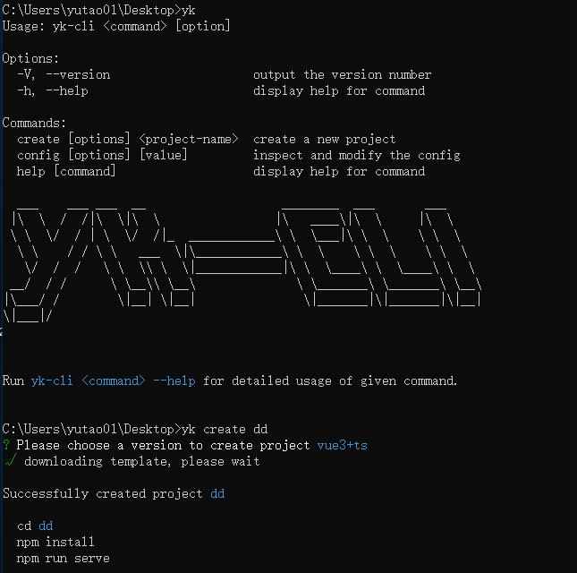

## yk-h5-cli 脚手架

- 功能: 支持下载模板 `create` 命令
- 全局命令可使用 `yk` 或 `yk-cli`

## 使用

目前主要功能为 create 命令，使用方法类似 vue-cli。
目前只支持Vue3+ts版本

## demo
如图：

## 采用三方模块

- [commander](https://github.com/tj/commander.js/blob/master/Readme_zh-CN.md)：命令配置工具
- [chalk](https://github.com/chalk/chalk)：命令行美化工具
- [inquirer](https://github.com/SBoudrias/Inquirer.js)：命令行交互工具
- [ora](https://github.com/sindresorhus/ora)：命令行 loading 效果
- [fs-extra](https://github.com/jprichardson/node-fs-extra)：更友好的文件操作
- [download-git-repo](https://gitlab.com/flippidippi/download-git-repo)：命令行下载工具
- [figlet](https://github.com/patorjk/figlet.js)：生成基于 ASCII 的艺术字
